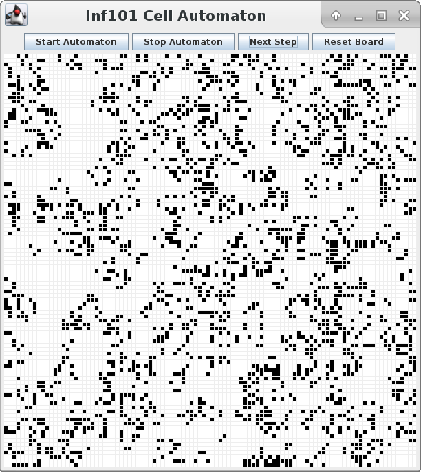

Lab 3 [](https://www.codacy.com/manual/torlunjen/lab3?utm_source=github.com&amp;utm_medium=referral&amp;utm_content=torlunjen/lab3&amp;utm_campaign=Badge_Grade)
===

## Læringsmål

* Bruke `interface`
* Lage klasser som `implementerer` et interface
* Lage egne datastrukturer 
* Bruke `enum`

## Klon koden 
Klon koden for denne lab-oppgaven fra ditt eget repositorie ved hjelp av URIen:

      https://retting.ii.uib.no/<brukernavn>/inf101.v20.lab3.git
      
Se på lab-oppgavene fra tidligere uker for detaljert beskrivelse av hvordan.

## 3.0 Celleautomater

I denne oppgaven skal vi laget et program for å simulere celleautomater.


**Hvis du allerede kjenner til celleautomater, eller vil begynne å kode med én gang, kan du [hoppe over introen](#31).**

### 3.0.1 A zero-player game called Game of Life
[John Conway](https://en.wikipedia.org/wiki/John_Horton_Conway#Conway's_Game_of_Life) er en teoretisk matematiker som fant opp et zero-player game kalt **Game of Life**. 

Conway spilte Game of Life med penn og papir eller ved hjelp av et [Go](https://en.wikipedia.org/wiki/Go_(game)) spillebrett, vist på bildet under, der brikkene representerer levende eller døde "celler". Han ble kjendis da den populærvitenskapelige journalisten Martin Gardner skrev om Game of Life i [Scientific American, October 1970](life.pdf).


Game of Life er en celleautomat, en type *computational model*. Computational models er ikke pensum i INF101 (men i master-kurset [INF210](https://www.uib.no/emne/INF210)). Du trenger ikke forstå hva det er for å gjøre oppgaven, men vi gir en liten intro til Game of Life fra dette perspektivet for å hjelpe deg å skjønne hensikten med programmet vårt. 

### 3.0.2 Computational what-now?

En *computational model* er en abstrakt maskin med et **minne** og et sett med **regler**. Minnet har en start-tilstand, ofte tenkt på som **input**. For å "kjøre" en slik model oppdaterer man minnet hver runde i henhold til reglene. 

Dette er ikke ulikt brettspill (f.eks. [Robo-Rally](https://boardgamegeek.com/boardgame/216201/robo-rally)) der hver spiller typisk gjør ett trekk og så oppdaterer man brettet før man går videre. I Game of Life er det ingen spillere så det eneste som skjer hver runde er at alle rutene på brettet oppdateres. 


I tilfellet av Game of Life, er minnet et rutenett av celler med verdien "død" eller "levende", og [**reglene**](https://en.wikipedia.org/wiki/Conway%27s_Game_of_Life#Rules) beskriver hvordan cellene blir oppdatert til å være levende eller døde i hvert oppdaterings-steg basert på verdiene til naboene. 

### 3.0.3 Regler på liv og død 
Spillet simulerer til en viss grad biologisk liv, ved at levende celler som har mange naboer dør av "ovebefolkning", levende celler med en eller ingen naboer dør av "isloasjon" og en celle med nøyaktig tre naboer er levende uansett om den var død eller ikke fra før: den kan altså bli "født". 


Vi kaller hver "runde" i spillet for en "generasjon". For hver generasjon oppdaterer vi alle cellene i rutenettet til å være enten levende eller døde, basert på reglene. 

Bildet under viser en "stabil" tilstand, der cellene aldri vil endre verdi. Sjekk selv basert på [reglene](https://en.wikipedia.org/wiki/Conway%27s_Game_of_Life#Rules).


### 3.0.4 Zero players != Zero fun
Til tross for at Game of Life aldri har vært noen slager på brettspillkveldene våre så lar vi lar oss gjerne fascinere av slike [fantastiske mønstrene](https://www.youtube.com/watch?v=C2vgICfQawE) kan oppstå fra slike enkle regler. 

*Det interessante med cellemaskiner er hvordan komplekse strukterer kan oppstå ved hjelp av veldig enkle regler, ikke ulikt ekte biologiske systemer.*


Det finnes andre celleautomater enn Game of Life. De har alle til felles at de er beskrevet ved hjelp av et netverk av celler med forskjellige verdier, og regler for oppdateringer. Dette lar oss *abstrahere* over dem og å definere en *abstrakt datatype* som inneholder egenskapene de har til felles:

- Et to-dimensjonal grid av "celle-states"
- Regler for hvordan griden skal oppdateres hver runde.

I denne oppgaven skal vi bruke en slik abstrakt datatype til å lage et grafisk grensensnitt som vi kan kjøre forskjellige typer celleautomater på.

# 3.1 Et rutenett av celler
*I denne oppgaven skal vi implementere en datastruktur som kan representere et rutenett av levende eller døde celler.*

En celleautomat består av celler organisert i en todimensjonal grid. Hver celle har en "celle-state", for eksempel `død` og `levende`. Vi kan tenke oss at svarte celler er levende og hvite celler er døde. 

Du har fått utlevert et delvis ferdig program for en celleautomat. Det er organisert i følgende pakker: 

- `inf101.v20.lab3.cellular` inneholder abstraksjonen av celleautomater
- `inf101.v20.lab3.cellular.gui` inneholder komponenter for knapper og grafikk
- `inf101.v20.lab3.cellular.datastructure` inneholder en datastruktur for rutenett av celle-states. 


Du er ferdig med hele ukesoppgaven når `Cellegrid.java` implmenterer `IGrid` korrekt ved hjelp av en List<CellState> fra Java Collections, og alle testene passerer.

**NB: Bruk en én-dimensjonal liste til å løse denne oppgaven.**

*Du kan jobbe ut ifra testene, dokumentasjonen og debuggeren, eller du kan bruke steg-for-steg guiden i de neste deloppgavene.*

## Steg-for-steg
CellGrid skal representere et grid av celler. Hver celle er identifisert ved en posisjon `(x, y)` og har 8 naboer - med mindre den ligger langs en kant. I illustrasjonen under har den blå cellen posisjon `(2,2)`  og er naboer med alle de røde cellene. 


🤔 *Hvilke datastrukturer passer til å implementere dette?*

I denne oppgaven skal vi øve på å bruke Java-Collections med generisk type. Selv om vi kunne ha løst dette enklere med en todimensjonal datastruktur, skal vi øve oss på å bruke en endimensjonal liste til å lagre alle cellene. 

✅ Legg inn metodene som CellGrid skal override slik at kompilatorfeilene i CellGrid-klassen går vekk. (`add-commit-push`)

🤔 Hvorfor ble det ikke kompilatorfeil der metodene som manglet ble kalt på IGrid-objekter? F.eks. `getWidth()`-metoden på linje 45 i GameOfLife.java.

✅ Legg inn konstruktør i CellGrid. (`add-commit-push`)

*Tips: se på feilmeldingene i de andre klassene for å se hva slags konstruktører resten av koden bruker til å lage objekter av CellGrid.* 

Hvis du har gjort dette riktig så skal koden være fri for feilmeldinger og CellGrid inneholder fem tomme medtoder og en tom konstruktør. For å implementere disse metodene riktig trenger CellGrid noen feltvariabler: en bredde-verdi (`width`), en høyde-verdi (`height`) og en datastruktur (`List<CellState>`) som holder på `widt*height` antall `CellState`-verdier. 

✅ Legg inn feltvariablene som mangler i `CellGrid` og *assign* verdier til dem i CellGrid-konstruktøren. Listen skal fylles med den CellState-verdien som blir gitt til konstruktøren. (`add-commit-push`)

*Tips: `List`-interfacet finnes i `Java.util`-pakken. Siden det er et interface kan du ikke lage objekter av den typen. I stedet kan du bruke ArrayList til å instansiere liste-objektet ditt.`*

Nå skal koden kompilere, og testene kjøre (men faile). Da kan vi begynne å implementere metodene. 

Det er ofte greit å starte fra de enkleste metodene: her er det `getHeight` og `getWidth`. Sjekk om det er tester for dem; i så fall kan du bruke testene sammen med dokumentasjonen i `IGrid` til å se hvordan de skal fungere. 

✅ Gjør ferdig metodene for `getHeight` og `getWidth`. (`add-commit-push`)

✅ Gjør ferdig metodene for `set` og `get`. Når du har gjort det riktig skal alle testene foruten `copyTest` passere. (`add-commit-push`)

Hvis du sitter fast her kan det være at du må gå tilbake til konstruktøren og listen som holder på CellStates. Har du gitt listen verdi? Hvor mange celler inneholder den? Hvordan kan du `simulere` en 2D-tabell i en endimensjonal liste? Bruk gjerne penn og papir til å få kontroll på indekser før du skriver koden. 

Legg merke til at to av testene sjekker at metodene kaster exceptions dersom de blir kalt med feil verdier. For å få dem til å passere må du legge inn sjekker for *forkrav* i metodene, og kaste riktig type exceptions når argumentene har feil verdier. 

Tips: For `set` og `get` må vi finne ut hvordan vi skal konvertere mellom (x,y) koordinater og indekser i en endimensjonal liste. En grei løsning er f.eks. at *indeks = x + (width * y)* – det vil si at dataene ligger lagret etter hverandre i listen, rad for rad (hver rad er *width* lang). 

Til slutt skal du gjøre ferdig metoden for å lage en kopi av en CellGrid. Ett forslag for hvordan denne metoden kan implementeres er: 

- Deklarer og instansier en en lokal variabel av typen `CelleGrid`
- For hver index i `this`, sett verdien i den nye variabelen til å være lik verdien i `this`
- Returner det nye objektet

✅ Gjør ferdig metoden for `copy`. Når du er ferdig skal alle testene passere. (`add-commit-push`)


# 3.2 Game of Life 
I denne oppgaven skal du gjøre ferdig GameOfLife-klassen. Denne klassen har ikke tester, så du må debugge den ved å kjøre programmet. (`Main` -> `Run as`->`Java Application`) og se om den oppfører seg riktig. 

Når du kjører spillet kan du sjekke oppførselen ved å se om du finner igjen noen av animasjonene fra tidligere i teksten? Sjekk ut animasjonene på Wikipedia-artikkelen om Game of Life og se om du finner 'blinker', 'block' og 'glider' på brettet ditt. 

Du er ferdig når programmet ditt oppfører seg i henhold til Game of Life-reglene.

### 3.2.0 Regler
Vi abstraherer Game of Life til et grid av celler som er enten døde eller levende. Alle cellene starter med en gitt cellestatus, og deretter oppdateres alle celler hvert tidssteg i henhold til reglene: 

- En levende celle med færre enn to levende naboer dør.
- En levende celle med to eller tre levende naboer overlever.
- En levende celle med mer enn tre levende naboer dør. 
- En død celle med nøyaktig tre levende naboer blir levende. 

**NB: Alle celler oppdateres samtidig; det vil si at du skal sjekke naboene slik de var når dette tidssteget startet, og ikke bruke verdier du alt har oppdatert.** 

### Steg-for-steg
Begynn med å lese koden i klassen du skal jobbe på og prøv å kjøre programmet for å se hva som skjer. Legg merke til at klassen implementerer interfacet `CellAutomaton`. Alle metodene med `@Override` er spesifisert der, så du kan gå dit for å lese dokumentasjonen deres. Det vil hjelpe deg å skjønne hvordan `GameOfLife`-klassen skal oppføre seg. 

Hvis du er usikker på hvor du skal starte å kode er det ofte lurt å starte med *low-hanging fruit*, slik som vi gjorde i CelleGrid-oppgaven. 

```
Low-hanging fruit (noun):
the most easily achieved of a set of tasks, measures, goals, etc.
```
I GameOfLife-klassen er de enkleste metodene `numberOfRows` og `numberOfColumns`. Les dokumentasjonen for å se hva de skal returnere. 

✅ Implementer `numberOfRows` og `numberOfColumns`. (`add-commit-push`)

🤔 Hvorfor heter det `numberOfRows` og `numberOfColumns` her, men `height` og `width` i `CellGrid`? 

Hvilken metode syns du ser enklest ut å gjøre ferdig nå? Vi anbefaler `getCellState`, siden `step` og `getLivingNeigbours` ser mer komplisert ut. Les dokumentasjonen for å se hva den skal returnere.

✅ Implementer `getCellState`. (`add-commit-push`) 

Nå er det tid for å legge inn reglene. Vi har lagt inn `//TODO`-kommentarer der du må skrive koden for reglene og for å finne levende naboer. 

- Step vil bli kalt hvert tidssteg og skal oppdatere alle cellestatusene i det nye `CellGrid`-objektet i henhold til reglene. 
	- *Tips: siden cellene ligger i en to-dimensjonal grid vil du sannsynligvis trenge to nestede for-løkker.*
- `getLivingNeighbours` er en *hjelpemetode* for `step`-metoden. Alle reglene baserer seg på antall levende naboer, så vi kan forenkle `step` ved å trekke ut denne funksjonaliteten til sin egen metode. 

`getLivingNeiogbours` er kanskje den vanskeligste delen av denne klassen. Du må hente ut alle verdiene til nabo-cellene og telle hvor mange av dem som har verdien `CellState.ALIVE`. Du kan bruke en dobbel løkke igjen eller du kan kode alle index-kombinasjoner, men husk at løsningen din må fungere på alle lovlige verdier av `x` og `y`, inkludert f.eks. (0, 0).

*Tips: pass på at du ikke teller med cellen på posisjonen (x, y).*

✅ Gjør ferdig implementasjonen av reglene for spillet i `step`-metoden, og hjelpemetoden som finner levende naboer. 

Nå kan du nok kjøre spillet, men det funker nok ikke helt enda. Kanskje kommer det `NullPointerExceptions`? Vi glemte visst å fikse en bug i `asColor`-metoden i `CellState`. Denne metoden skal "oversette" fra CellState til farge. Sjekk om den ser riktig ut; hvis ikke, så må du fikse den. 

✅ Du er ferdig når spilet kjører riktig! Husk å `add-commit-push` til ditt eget GitLab-repositorie! 



## 3.3 Valgfritt 

### 3.3.1 Brian's Brain
Det finnes mange forskjellige CelleAutomater. Nå har du rammeverket klart for å implementere enda en automat. Vi anbefaler å prøve seg på [Brian's Brain](https://en.wikipedia.org/wiki/Brian%27s_Brain).


Da kan du opprette en ny klasse BriansBrain.java i _cellular_-pakken som ser ut som følger: 

```java 
public class BriansBrain implements CellAutomaton{
}
```
Den vil langt på vei være lik GameOfLife, men bruke andre regler. Antall cellestates er også én høyere: du må også legge til en tredje verdi `DYING` i CellState-enumen og utvide toColor()-metoden med enda en `if-else`-setning og en tredje (valgfri) farge.  

For å kjøre den nye celleautomaten din erstatter du bare koden `CellAutomaton ca = new GameOfLife(100,100)` i main-metoden med `CellAutomaton ca = new BriansBrain(100,100)`. 

